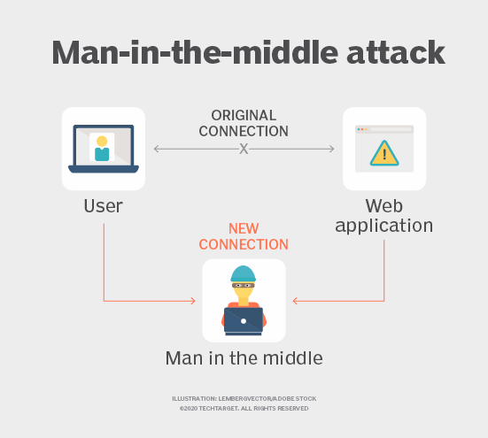

# NETWORK ATTACKS 

## DICTIONARY ATTACK

### DEFINICIÓN

> Un ataque de diccionario es un ataque de fuerza bruta que tiene como objetivo obtener acceso a las cuentas de los usuarios mediante el uso de frases o palabras de uso común en un diccionario para adivinar contraseñas. También es muy utilizado para intentar encontrar la clave para descifrar un mensaje o documento cifrado.

> A pesar de que en muchas ocasiones es un método poco exitoso, los ataques de diccionario siguen funcionando en muchas ocasiones porque los usuarios recurren a contraseñas que son palabras fáciles de adivinar. Estos ataques generalmente no tienen éxito contra los sistemas que utilizan contraseñas formadas por letras mayúsculas, minúsculas, caracteres y números en combinaciones aleatorias.

> Estos ataques son tan comunes que cada vez más son los desarrolladores de aplicaciones y sitios web que imponen reglas más estrictas sobre qué tipos de contraseñas están permitidas. Al igual que otros ataques, el objetivo es robar información personal del usuario.

