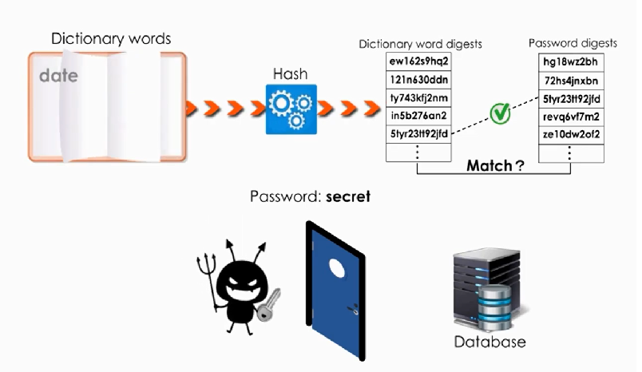
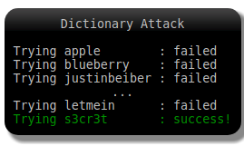
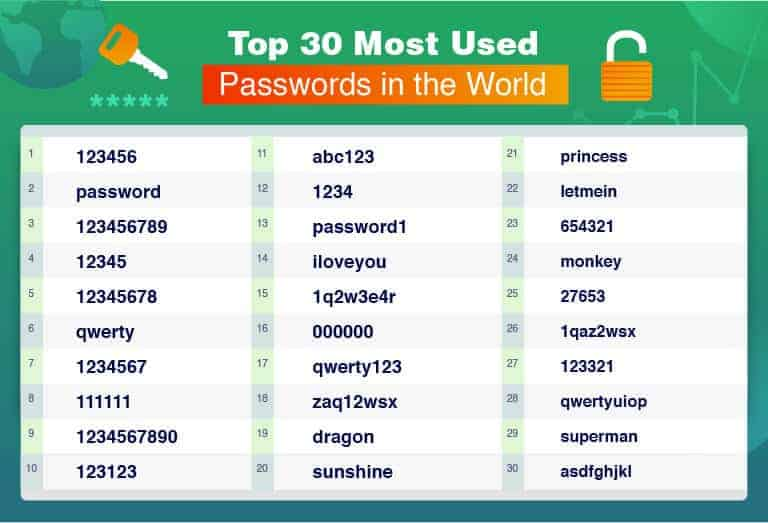
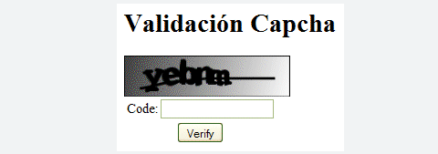
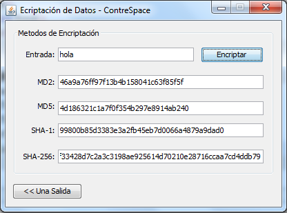
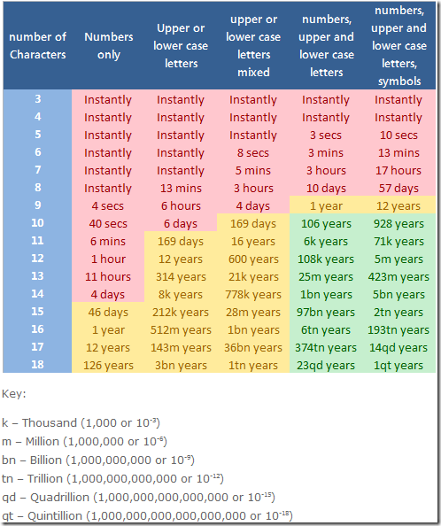

# NETWORK ATTACKS

## DICTIONARY ATTACK

### DEFINICIÓN

Un ataque de diccionario es un ataque de fuerza bruta que tiene como objetivo obtener acceso a las cuentas de los usuarios mediante el uso de frases o palabras de uso común en un diccionario para adivinar contraseñas. También es muy utilizado para intentar encontrar la clave para descifrar un mensaje o documento cifrado.

A pesar de que en muchas ocasiones es un método poco exitoso, los ataques de diccionario siguen funcionando en muchas ocasiones porque los usuarios recurren a contraseñas que son palabras fáciles de adivinar. Estos ataques generalmente no tienen éxito contra los sistemas que utilizan contraseñas formadas por letras mayúsculas, minúsculas, caracteres y números en combinaciones aleatorias.

> Estos ataques son tan comunes que cada vez más son los desarrolladores de aplicaciones y sitios web que imponen reglas más estrictas sobre qué tipos de contraseñas están permitidas. Al igual que otros ataques, el objetivo es robar información personal del usuario.

### DIFERENCIAS ENTRE ATAQUE POR FUERZA BRUTA Y ATAQUE DE DICCIONARIO

Los ataques de fuerza bruta se usan mejor para contraseñas cortas y aleatorias, mientras que los ataques de diccionario son mejores herramientas para descifrar contraseñas más largas basadas en palabras reales o cualquier palabra que se tenga en el diccionario. Los ataques de diccionario son un poco más difíciles de configurar que los ataques de fuerza bruta, pero aún así no son demasiado complicados.

### CÓMO EVITAR UN ATAQUE DE DICCIONARIO

Cualquier departamento IT de cualquier empresa debería tomar medidas para proteger a sus sistemas de a ataques de diccionario. **Los ataques online son fáciles de detener**, por ejemplo, **utilizando captchas, la autenticación de dos factores y limitando el número de intentos del usuario a la hora de iniciar sesión antes de bloquear su cuenta.**

> La cosa se complica cuando se trata de ataques offline. Aun así, es recomendable implementar la autenticación de dos factores y establecer reglas estrictas en materia de contraseñas: nada de contraseñas populares, nada de palabras o frases comunes, 12 caracteres mínimo, etc. Y lo más importante, no guardar las contraseñas en formato de texto sin encriptar.

Otra de las recomendaciones es que no seas predecible a la hora de establecer una contraseña. Las mejores contraseñas están compuestas por palabras que no significan nada para la mayor parte del público. Ten presente que la longitud de la contraseña no determina su seguridad. No importa que elijas “pachycephalosaurus” o "gato" como contraseña; un ordenador tardará lo mismo en introducir ambas. Así que crea nuevas palabras, utiliza caracteres especiales originales o, mejor aún, escribe una cadena de letras en minúscula, mayúscula, símbolos y números.

